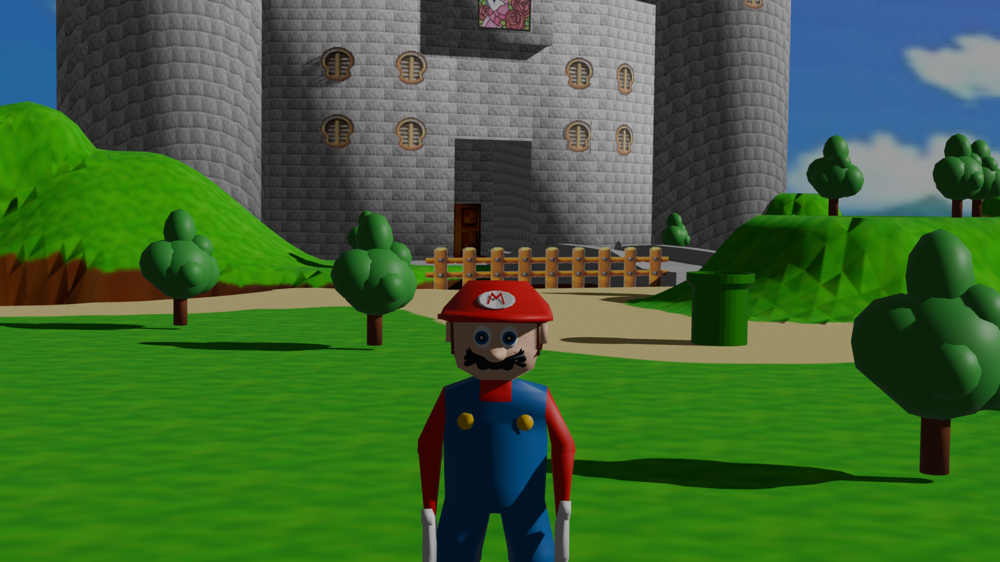
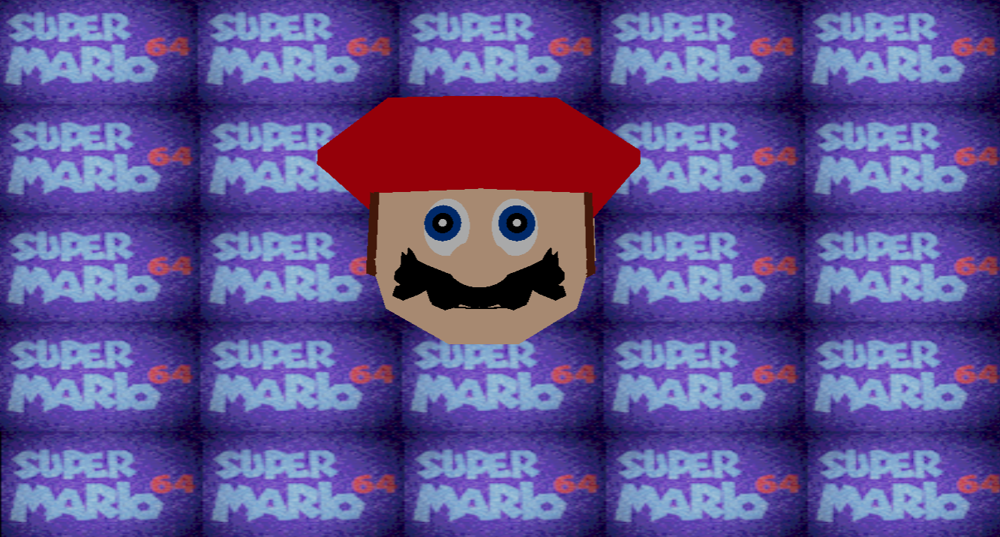
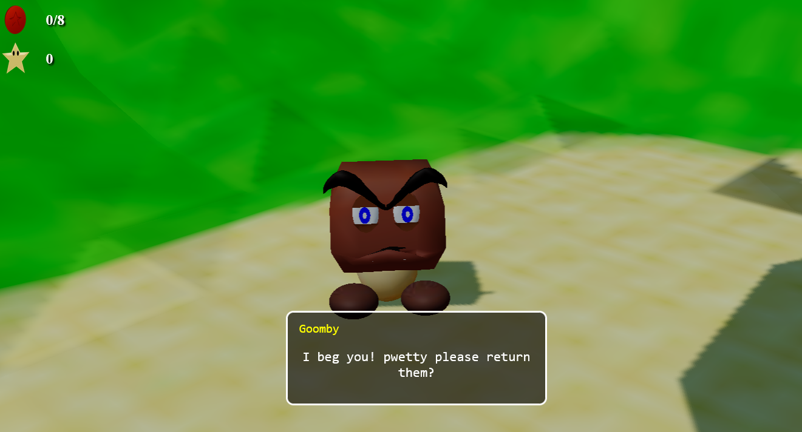
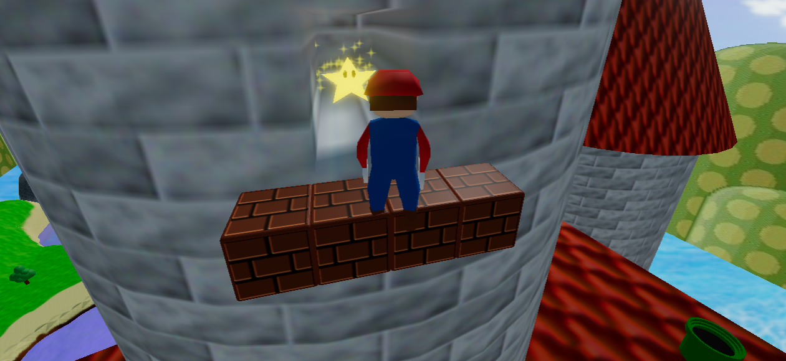

# Mario64 / Threejs

## Images





## Description

```
- Mario 64 mini-game made with Blender/Threejs
```

---
### BloodLordSoth
[GitHub](http://github.com/BloodLordSoth) | [YouTube](http://youtube.com/@BloodLordSoth)
